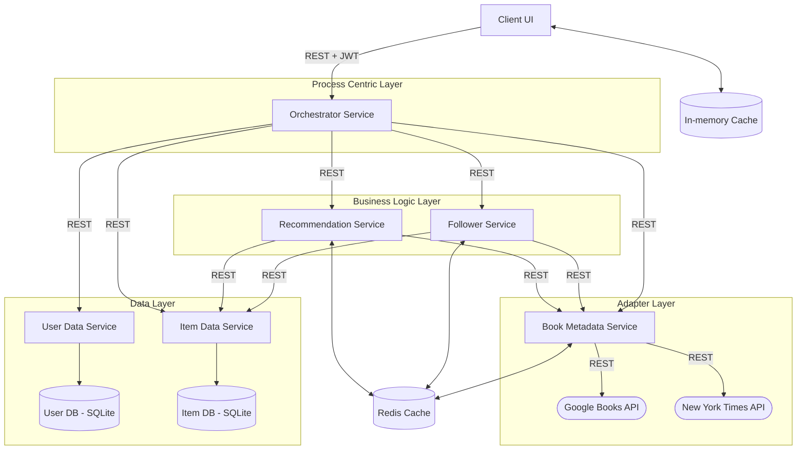
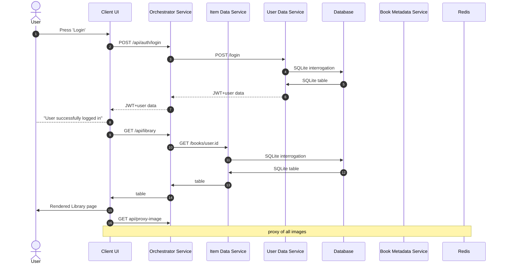
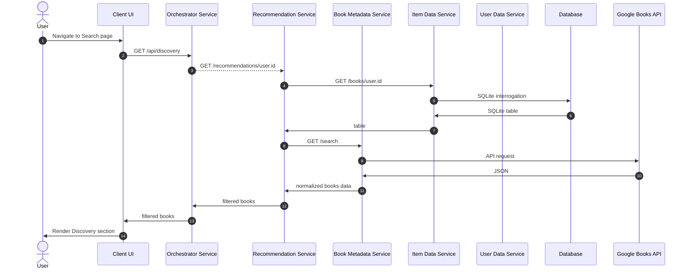
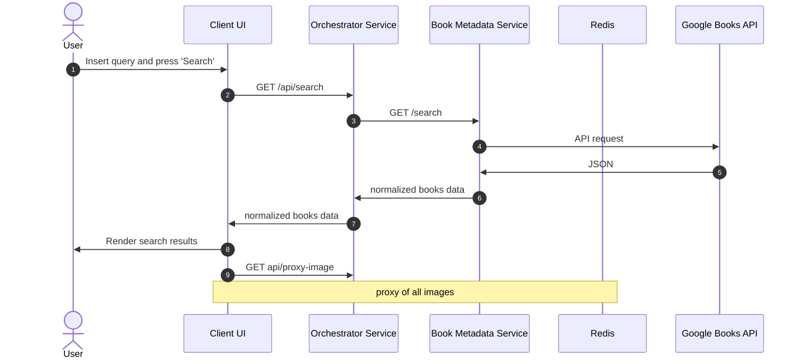

# Hive Books - Documentation
_By Antonio Betalli \[mat. 258772\]_

---
## Architecture Flowchart 

---
## API Endpoints

#### External APIs
##### Google Books API
In the project I used the `https://www.googleapis.com/books/v1/volumes` endpoint.
**Example Usage**: `https://www.googleapis.com/books/v1/volumes?q=Divina+commedia`

**Documentation**: [Google Books API Documentation](https://developers.google.com/books/docs/v1/using)
##### New York Times (NYT) Books API
In the project I used the `https://api.nytimes.com/svc/books/v3/lists/current/` endpoint
**Example Usage**: `https://api.nytimes.com/svc/books/v3/lists/current/hardcover-fiction.json?api-key=YOUR_API_KEY`

**Documentation**: [NYT Books API Documentation](https://developer.nytimes.com/docs/books-product/1/overview)

### Services Endpoints
#### Orchestrator Service
The entry point for the frontend application. It proxies requests to various microservices and handles authentication.

| Method | Endpoint             | Description                                |
| :----- | :------------------- | :----------------------------------------- |
| GET    | `/health`            | Service health status.                     |
| POST   | `/api/auth/login`    | User login. Returns JWT.                   |
| POST   | `/api/auth/register` | User registration. Returns JWT.            |
| GET    | `/api/library`       | Get the user's book saved in his library.  |
| POST   | `/api/books/add`     | Add a new book to the library.             |
| PUT    | `/api/books/:id`     | Update book details in the library.        |
| DELETE | `/api/books/:id`     | Remove a book from the library.            |
| GET    | `/api/search`        | Search for books.                          |
| GET    | `/api/discovery`     | Get personalized book recommendations.     |
| GET    | `/api/new-releases`  | Get new releases from authors in library.  |
| GET    | `/api/last-releases` | Get last releases from authors in library. |
| GET    | `/api/proxy-image`   | Proxy for book thumbnails.                 |
#### User Data Service
Handles user registration, login, and profile data. Ensures authentication using JWT

| Method | Endpoint     | Description                         |
| :----- | :----------- | :---------------------------------- |
| GET    | `/health`    | Service health status.              |
| POST   | `/register`  | Create a new user and return a JWT. |
| POST   | `/login`     | Authenticate user and return a JWT. |
| GET    | `/users/:id` | Get public profile of a user.       |
#### Item Data Service
Is the middleware between other services and the database regarding the books in the user's library. 

| Method | Endpoint          | Description                                 |
| :----- | :---------------- | :------------------------------------------ |
| GET    | `/health`         | Service health status.                      |
| GET    | `/books/:user_id` | Get all books of a specific user's library. |
| POST   | `/books`          | Save a new book entry.                      |
| PUT    | `/books/:id`      | Update an existing book entry.              |
| DELETE | `/books/:id`      | Delete a book entry.                        |

It should support also GraphQL. The current project required few types of requests, making REST more effective.
#### Book Metadata Service
An adapter for external book APIs (Google & NYT) that normalizes data, handles image caching and centralize some book's categories.

| Method | Endpoint         | Description                                                                     |
| :----- | :--------------- | :------------------------------------------------------------------------------ |
| GET    | `/health`        | Service health status.                                                          |
| GET    | `/search`        | Search books via Google Books API. It exploit many of the attributes available. |
| GET    | `/isbn/:isbn`    | Fetch specific book metadata by ISBN.                                           |
| GET    | `/nyt/:category` | Fetch bestsellers from NYT by category.                                         |
| GET    | `/genres/:label` | Get the map of specific genre.                                                  |
| GET    | `/proxy-image`   | Fetches and caches images from external URLs.                                   |
#### Follower Service
Tracks author based on the user's library content. Provide a list of all new released books, in the last 12 months, by that authors and for each one of them a list of the last 5 books they released.

| Method | Endpoint                  | Description                                                |
| :----- | :------------------------ | :--------------------------------------------------------- |
| GET    | `/health`                 | Service health status.                                     |
| GET    | `/new-releases/:user_id`  | Returns recent releases for authors in the user's library. |
| GET    | `/last-releases/:user_id` | Returns latest books for authors in the user's library.    |
#### Recommendation Service
Generates book raccomandations based on user's library. If the library has enough books, it displays a list of books based on genre preferences; otherwise, it displays the most popular books at the moment.

| Method | Endpoint                    | Description                                    |
| :----- | :-------------------------- | :--------------------------------------------- |
| GET    | `/health`                   | Service health status.                         |
| GET    | `/recommendations/:user_id` | Personalized raccomandations based on library. |

---
## Caching

### Redis (Image Caching)

Used in the **Book Metadata Service** to store book thumbnails.
This is for avoid to hit rate limits of external providers (like in this case Google) and reduce the latency for this type of request.

Used also in **Follower Service** and **Recommendation Service**, mainly for reduces latency and avoids redundant fetchs to the **Item Data** and **Book Metadata** services for frequently requested data
### In-Memory (Query Caching)

Implemented in client side.
This is for avoid to redo already processed requests to **Follower Service** and **Recommendation Service**. The user can still force a refatch but iwith a rate limit for minutes.

---
## Examples with a Sequence Diagram 

 

---
 

 

---

 

