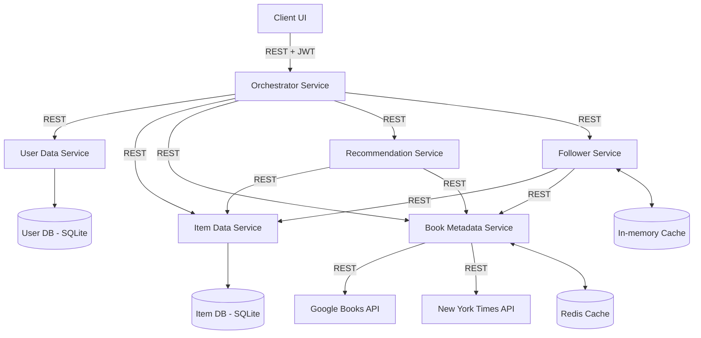

# Hive Books
A modern book virtual library platform built with a microservices architecture. Users can search for books using our search engine, get personalized recommendations based on the books in the library and

## Quick Start

### Prerequisites

- **Docker** and **Docker Compose** installed
- **Node.js** and **npm** (for DEV)

### 1. Start the Application

Use the provided Docker Compose file to start all services:

#### DEV mode
```bash
docker compose -f docker-compose.yml -f docker-compose.dev.yml up --build
```

#### PROD mode
```bash
# Build the images
docker compose -f docker-compose.yml build
# Start the services
docker compose -f docker-compose.yml up
```

This will start:
- **API Gateway** on port `3000`
- **Book Metadata Service** on port `3003`
- **User Data Service** on port `3004`
- **Recommendation Service** on port `3005`
- **Follower Service** on port `3006`

And the website will be available on `http://localhost:3000`

## 📂 Project Structure

```
hive_books/
├── services/
│   ├── book-metadata/      # Google Books and NYT API Adapter
│   ├── follower/           # Servizio per rilasci recenti e autori seguiti
│   ├── item-data/          # Persistence layer per la libreria (SQLite + GraphQL/REST)
│   ├── orchestrator/       # API Gateway e orchestrazione workflow
│   ├── recommendation/     # Motore di suggerimenti basato sulla libreria
│   └── user-data/          # Gestione utenti e autenticazione (SQLite)
├── docker-compose.yml     # Main Docker Compose file
├── docker-compose.dev.yml # Development-specific config
└── README.md              # This file
```




## 📚 Tech & Tools

### Core Backend & Orchestration
- **Node.js**: Runtime per tutti i microservizi.
- **Express**: Framework web per la creazione di API REST.
- **Axios**: Utilizzato per la comunicazione inter-servizio e chiamate API esterne.
- **Concurrently**: Per avviare tutti i servizi con un singolo comando dalla root.
- **Docker** - Containerization

### Data Layer
- **SQLite3**: Database SQL leggero e file-based per utenti e librerie.
- **GraphQL (`graphql-http`)**: Disponibile in `item-data` per query flessibili sulla libreria.
- **Bcrypt.js**: Per l'hashing sicuro delle password.
- **JWT** - Authentication
- **Redis** - Caching and message queue

### Frontend
- **Vanilla JavaScript (ES6+)**: Gestione dello stato e interazione senza framework pesanti.
- **Tailwind CSS**: Framework utility-first per un design moderno e responsive.
- **Font Awesome**: Per l'iconografia.

### External APIs
- **Google Books API**: Fonte principale per i metadati dei libri e la ricerca.
- **New York Times API**: Fonte secondaria per i metadati dei libri e la ricerca.
